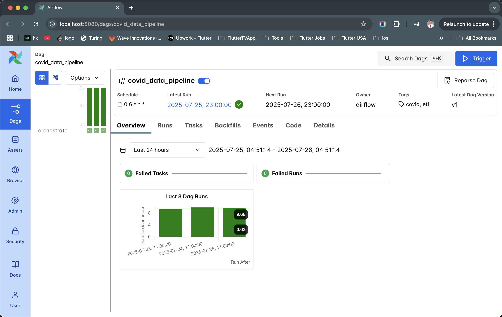
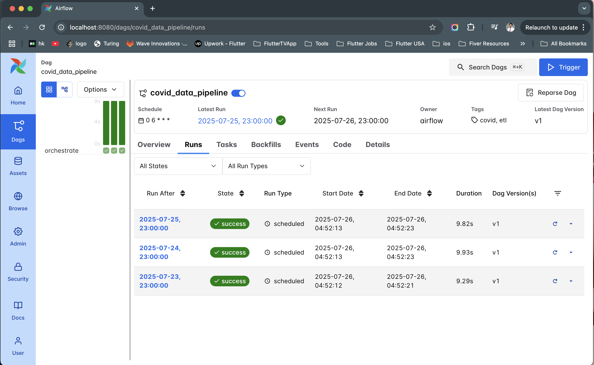

# COVID-19 ETL Pipeline

A production-grade ETL pipeline for processing COVID-19 data from BigQuery public datasets, featuring robust data transformation and storage capabilities.

---

## 🏗️ Architecture Overview

This project is built using **Clean Architecture** and **Domain-Driven Design (DDD)** principles.  
**Why?**  
- **Separation of concerns:** Each layer has a clear responsibility, making code easier to maintain and extend.
- **Testability:** Business logic is isolated from infrastructure, so you can write fast, reliable unit tests.
- **Scalability:** You can swap out databases, APIs, or other integrations with minimal changes to core logic.
- **Inspiration for developers:** This structure is ideal for learning how to build robust, production-grade data pipelines.

**Layers:**
- **Domain Layer:**  
  Contains business logic, use cases, and value objects (Calculating COVID statistics, validating data). 
- **Data Layer:**  
  Models, repositories, and data sources (Mapping BigQuery results to Python objects, saving records to PostgreSQL).
- **Infrastructure Layer:**  
  Integrations with external systems (BigQuery, PostgreSQL).
- **Presentation Layer:**  
  Orchestration, dependency injection, and entry points(Main pipeline runner, Airflow DAGs).

---

## 📊 Data Source

- **BigQuery Public Dataset:**  
  `bigquery-public-data.covid19_open_data.covid19_open_data`

---

## 🚀 Quick Start

### Prerequisites

- Python 3.11+
- PostgreSQL database (Docker)
- Google Cloud credentials (for BigQuery access)

### 1. Environment Setup

```bash
python -m venv .venv
source .venv/bin/activate
pip install -r requirements.txt
```

### 2. Database Setup

Run PostgreSQL using Docker:

```bash
docker run -d \
  --name my-postgres \
  -p 5432:5432 \
  -e POSTGRES_PASSWORD=your_db_password \
  postgres
```

### 3. Configuration

**BigQuery Setup Instructions:**

1. Go to [Google Cloud Console](https://console.cloud.google.com/).
2. Create or select your project (e.g., `carbon-zone-466205-r5`).
3. Navigate to **IAM & Admin > Service Accounts**.
4. Create a new service account (or use an existing one).
5. Grant it the necessary BigQuery permissions (e.g., BigQuery Data Viewer).
6. Click on the service account, go to **Keys**, and create a new key (JSON).
7. Download the JSON file.
8. **Place the downloaded JSON file inside your project's `config/` folder.**
   - Example: `config/carbon-zone-466205-r5-baaa1a665c04.json`
9. Make sure the path in your config matches the filename.

This will allow your pipeline to authenticate and access BigQuery data.


Rename `config/app_config.toml.sample` file to `config/app_config.toml` and
edit your config in [config/app_config.toml](config/app_config.toml.sample):

```toml
[postgres]
HOST = "192.168.0.236"  # Your IP
USERNAME = "db_user_name"
PASSWORD = "db_password"
PORT = "5432"
DB_NAME = "your_db_name"

[bigquery]
PROJECT_ID = "carbon-zone-4603345386205-r5"
SERVICE_ACCOUNT_FILEPATH = "config/carbon-zone-4uyt205-r5-baaa1a665c04.json"
```

### 4. Create Database Table

```sql
CREATE TABLE covid_daily_records (
    date DATE NOT NULL,
    country_code VARCHAR(10) NOT NULL,
    country_name TEXT,
    new_confirmed INTEGER,
    new_deceased INTEGER,
    cumulative_deceased INTEGER,
    cumulative_tested INTEGER,
    population_male INTEGER,
    population_female INTEGER,
    smoking_prevalence NUMERIC,
    diabetes_prevalence NUMERIC,
    PRIMARY KEY (country_code, date)
);
```

### 5. Run ETL Pipeline Locally

```bash
python main.py --cron-name covid_data_orchestrator --start-date 2020-08-01 --end-date 2020-08-02
```

---

## 🗓️ Scheduling with Airflow (Optional)

### 1. Start Airflow Locally

```bash
docker-compose up --build
```

- Access Airflow UI at [http://localhost:8080](http://localhost:8080/dags/covid_data_pipeline)
- Login with default credentials (username: `airflow`, password: `airflow`)

**🔍 Covid Data Pipeline Overview**



**⏱️ Scheduled Execution**



### 2. Disable Example DAGs in Airflow UI (Optional)

- If example DAGs appear in your Airflow UI,just restart Airflow usig.
  ```bash
  docker-compose down
  docker volume rm airflow-data-pipeline_postgres-db-volume
  docker-compose up --build
  ```
---


## 🧪 Testing

Run all tests and check coverage:

```bash
PYTHONPATH=$(pwd) pytest --cov=etl_covid_19 --cov-report=term-missing test/
```

---

## 📁 Project Structure

```
etl_covid_19/
├── service_locator.py
├── data/
│   ├── data_source/
│   ├── model/
│   └── repository/
├── domain/
│   ├── services/
│   ├── use_cases/
│   └── value_objects/
├── infrastructure/
│   ├── bigquery/
│   └── database/
├── presentation/
│   ├── base_cron_job.py
│   └── covid_data_orchestrator.py
config/
│   ├── app_config.toml
│   ├── config_loader.py
│   ├── config_model.py
│   └── airflow.cfg
dags/
│   ├── covid_data_etl.py
│   └── .airflowignore
test/
├── data/
│   ├── data_source/
│   ├── model/
│   └── repository/
├── domain/
│   ├── services/
│   ├── use_cases/
│   └── value_objects/
├── infrastructure/
│   ├── bigquery/
│   └── database/
├── presentation/
│   ├── test_base_cron_job.py
│   └── test_covid_data_orchestrator.py
├── setup.py
├── main.py
├── docker-compose.yaml
├── dockerfile
....
```

---

## 🌟 Why Follow This Project?

- **Learn Clean Architecture & DDD:**  
  See how to structure real-world data pipelines for maintainability and scalability.
- **Production-Ready Patterns:**  
  Use dependency injection, configuration management, and robust error handling.
- **Easy Testing:**  
  Write unit and integration tests with clear separation of logic.
- **Airflow Integration:**  
  Schedule and monitor ETL jobs with industry-standard tools.
- **Inspiration:**  
  Adopt best practices for your own data engineering projects.

---

## 📞 Support

- 📧 Email: hadiuzzaman908@gmail.com
- 🐛 Issues: [GitHub Issues](https://github.com/hadiuzzaman524/python-clean-architecture/issues)


